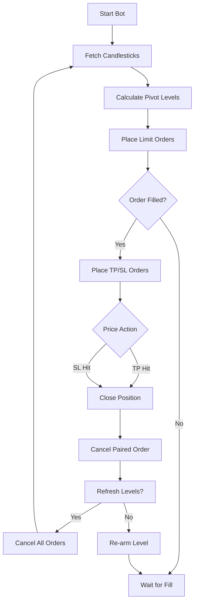
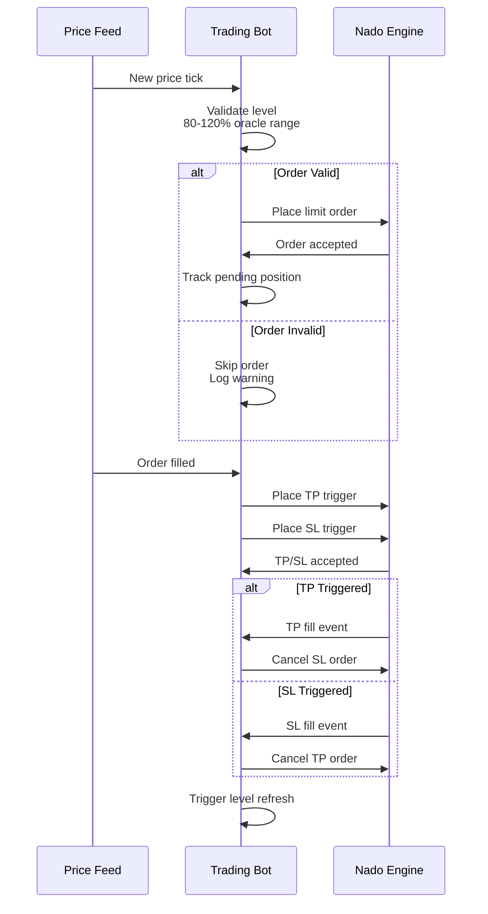

# Nado Level-Based Perp Trading Bot

A high-performance TypeScript trading bot built on the [Nado SDK](https://docs.nado.xyz/developer-resources/typescript-sdk). Automatically calculates dynamic pivot point-based levels for BTC and ETH perpetuals on the Ink network (Testnet & Mainnet).

See [🏗 Architecture](#-architecture) for detailed flow diagrams.

## 🚀 Overview

The bot monitors real-time price feeds via WebSockets and automatically manages limit orders at dynamically calculated support and resistance levels. When an entry is filled, it immediately attaches take-profit (TP) and stop-loss (SL) trigger orders.

### Key Features

- **Real-time execution**: Uses WebSockets for sub-second reaction to price changes and fills.
- **Dynamic Pivot Points**: Automatically calculates support/resistance from 24-hour candlestick data.
- **Periodic Refresh**: Recalculates levels every 60 minutes with auto-cancel & replace.
- **Automated Risk Management**: Automatic TP/SL placement on every fill.
- **Position Tracking**: In-memory state machine to track order lifecycle.
- **Graceful Handling**: Automatically cancels active orders on shutdown.

## 🛠 Prerequisites

- [Bun](https://bun.sh/) (recommended) or Node.js
- An Ethereum private key with funds on **Ink** or **Ink Sepolia**
- Testnet USDT (for Ink Sepolia) - Get it from the [Nado Faucet](https://testnet.nado.xyz/portfolio/faucet)

## 📦 Installation

1. **Clone and install dependencies:**
   ```bash
   bun install
   ```

2. **Setup environment variables:**
   ```bash
   cp .env.example .env
   ```
   Edit `.env` and provide your `PRIVATE_KEY`.

## ⚙️ Configuration

Configure the bot via the `.env` file:

| Variable | Description | Default |
|----------|-------------|---------|
| `PRIVATE_KEY` | Wallet private key (with 0x prefix) | - |
| `CHAIN_ENV` | Network (`inkTestnet` or `inkMainnet`) | `inkTestnet` |
| `LEVEL_REFRESH_MINUTES` | Refresh interval (minutes) | `60` |
| `LOOKBACK_HOURS` | Candlestick history for pivot calculation | `24` |
| `R_LEVELS_COUNT` | Number of resistance levels (R1, R2...) | `2` |
| `S_LEVELS_COUNT` | Number of support levels (S1, S2...) | `2` |
| `TP_PERCENT` | Take-profit % from entry | `1.5` |
| `SL_PERCENT` | Stop-loss % from entry | `0.75` |
| `ORDER_SIZE_BTC` | BTC amount per order | `0.01` |
| `ORDER_SIZE_ETH` | ETH amount per order | `0.1` |

## 📈 Strategy Logic

### Pivot Point Formula

Uses Standard Pivot Points calculated from 1-hour candlesticks:

```
Pivot (PP) = (High + Low + Close) / 3

R1 = (2 × PP) - Low        |  S1 = (2 × PP) - High
R2 = PP + (High - Low)    |  S2 = PP - (High - Low)
```

- **R1, R2** → Short entries (sell at resistance, above price)
- **S1, S2** → Long entries (buy at support, below price)

### Dynamic Refresh Cycle

Every 60 minutes (configurable via `LEVEL_REFRESH_MINUTES`):

1. Fetch new 1-hour candlesticks from Nado Indexer
2. Recalculate pivot levels (PP, R1, R2, S1, S2)
3. Cancel all pending entry orders
4. Cancel all active TP/SL trigger orders
5. Place new limit orders at fresh pivot levels

## 📊 Position Lifecycle

Positions transition through states based on order events:

| State | Description | Next States |
|-------|-------------|-------------|
| `pending` | Limit order placed, waiting for fill | `filled`, `cancelled` |
| `filled` | Entry filled, TP/SL attached | `tp_hit`, `sl_hit` |
| `tp_hit` | Take-profit triggered | - |
| `sl_hit` | Stop-loss triggered | - |
| `cancelled` | Order cancelled externally or on refresh | - |

On `tp_hit` or `sl_hit`, the bot:
1. Closes the position
2. Cancels the paired TP/SL order
3. Triggers a levels refresh (auto-cancel & replace)

## 🏗 Architecture

### Overall Bot Flow




### Order Lifecycle Sequence



## ⚠️ Disclaimer

This bot is for educational purposes. Trading perpetuals involves significant risk. Always test your strategies on `inkTestnet` before moving to `inkMainnet`. The authors are not responsible for any financial losses incurred.
